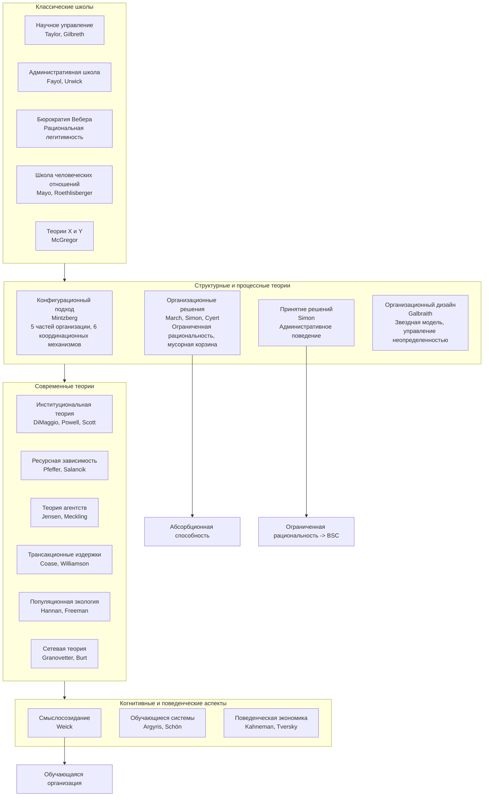
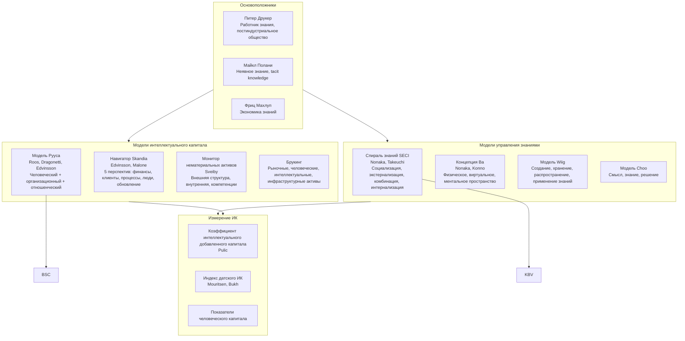
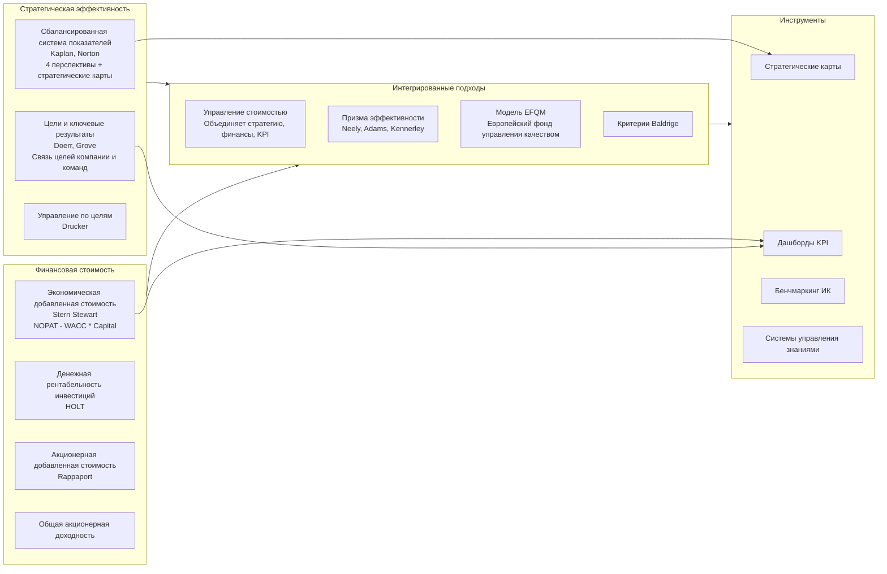
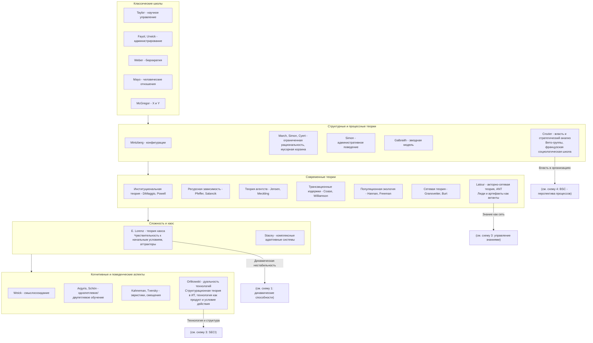
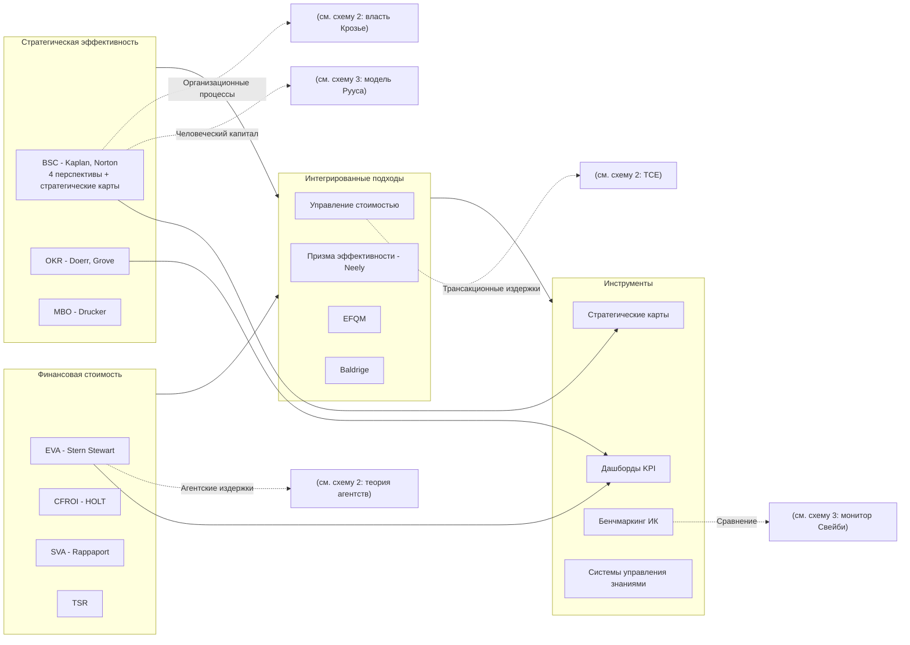

## graph
Граф взаимосвязи в формате Mermaid, охватывающий перечисленные модели (BSC, IC Рууса, Intangible Assets Monitor, Skandia Navigator, EVA, SECI, VBM), элементы из "Теории организации" и смежные области.
### 1
Ниже представлен обширный граф взаимосвязей в формате **Mermaid**, объединяющий ключевые модели управления стоимостью и знаниями с фундаментальными концепциями теории организации. Граф построен по иерархическому принципу: от общих областей знания к конкретным подходам, с подписями особенностей каждого ответвления.


ver2 (ver1 - c ошибкой, см. temp1.md)



```mermaid
flowchart TB
    subgraph L0 ["Области знаний (мета-уровень)"]
        SM["Стратегический менеджмент<br>Фокус: долгосрочные цели"]
        KM["Управление знаниями<br>Фокус: создание, передача знаний"]
        TO["Теория организации<br>Фокус: структура, процессы"]
        CF["Корпоративные финансы<br>Фокус: стоимость капитала"]
    end

    subgraph L1a ["Классические школы теории организации"]
        CT["Классическая школа<br>Тейлор, Файоль<br>Принципы администрирования"]
        BW["Бюрократия Вебера<br>Рационально-легальная власть"]
        HS["Школа человеческих отношений<br>Мэйо, Макгрегор<br>Неформальные группы"]
        SD["Системно-динамический подход<br>Форрестер, Сенге<br>Обратные связи"]
    end

    subgraph L1b ["Современные теории организации"]
        IT["Институциональная теория<br>Изоморфизм, легитимность"]
        RD["Теория ресурсной зависимости<br>Власть, контроль над ресурсами"]
        AT["Теория агентств<br>Принципал-агент, контракты"]
        TCE["Теория трансакционных издержек<br>Make-or-buy, границы фирмы"]
        PE["Популяционная экология<br>Отбор, смертность организаций"]
        NT["Сетевая теория<br>Слабые связи, структурные дыры"]
    end

    subgraph L2 ["Модели измерения эффективности"]
        BSC["Сбалансированная система показателей<br>Каплан, Нортон<br>4 перспективы, стратегические карты"]
        EVA["Экономическая добавленная стоимость<br>Остаточный доход, стоимость капитала"]
        VBM["Управление стоимостью<br>Интеграция стратегии, финансов, КПЭ"]
    end

    subgraph L3 ["Модели интеллектуального капитала и управления знаниями"]
        IC_Ruus["Интеллектуальный капитал Рууса<br>Человеческий, организационный, отношенческий"]
        IC_Skandia["Навигатор Skandia<br>Эдвинссон, Мэлоун<br>5 перспектив"]
        IAM["Монитор нематериальных активов<br>Свейби<br>Внешняя структура, компетенции"]
        SECI["Модель SECI<br>Нонака, Такеучи<br>Социализация, экстернализация, комбинация, интернализация"]
    end

    subgraph L4 ["Интегративные концепции"]
        OL["Обучающаяся организация<br>Сенге<br>Пять дисциплин"]
        AMC["Абсорбционная способность<br>Коэн, Левинталь<br>Усвоение внешних знаний"]
        KBV["Теория знаний фирмы<br>Грант, Нонака<br>Знание как главный ресурс"]
        DC["Динамические способности<br>Тис, Пизано, Шуен<br>Адаптация, сенсоринг"]
    end

    subgraph L5 ["Практические инструменты"]
        SM_Strategy["Стратегические карты"]
        KPI["KPI и OKR"]
        BA["Бенчмаркинг нематериальных активов"]
        KM_Tools["Инструменты управления знаниями"]
    end

    %% Связи между областями знаний и подходами
    SM --> BSC
    SM --> VBM
    SM --> DC
    KM --> IC_Ruus
    KM --> IC_Skandia
    KM --> IAM
    KM --> SECI
    KM --> KBV
    KM --> AMC
    KM --> OL
    TO --> CT
    TO --> BW
    TO --> HS
    TO --> SD
    TO --> IT
    TO --> RD
    TO --> AT
    TO --> TCE
    TO --> PE
    TO --> NT
    CF --> EVA
    CF --> VBM

    %% Взаимосвязи между теориями организации и моделями
    AT --> BSC
    TCE --> VBM
    RD --> NT
    IT --> IAM
    HS --> OL
    SD --> SECI

    %% Связи между моделями ИК и измерительными системами
    IC_Ruus --> BSC
    IC_Skandia --> IAM
    SECI --> KBV
    KBV --> DC
    DC --> BSC

    %% Связи с практическими инструментами
    BSC --> SM_Strategy
    BSC --> KPI
    IC_Ruus --> BA
    SECI --> KM_Tools
    EVA --> KPI
    VBM --> EVA
    VBM --> BSC

    %% Кросс-связи
    NT --> IC_Ruus
    PE --> DC
    TCE --> KBV
    AT --> EVA
    OL --> SECI
    AMC --> DC

```

## Пояснение к структуре графа

Граф разделён на логические уровни (от самых общих областей до конкретных инструментов):

1. **Области знаний** (мета-уровень) — определяют фундаментальные дисциплины: стратегический менеджмент, управление знаниями, теорию организации, корпоративные финансы.
2. **Классические и современные теории организации** — здесь показаны ключевые школы с подписями об их особенностях.
3. **Модели измерения эффективности** (BSC, EVA, VBM) — фокус на финансовых и нефинансовых показателях.
4. **Модели интеллектуального капитала** (Руус, Свейби, Эдвинссон) и **модели управления знаниями** (SECI, Нонака).
5. **Интегративные концепции** (обучающаяся организация, динамические способности, абсорбционная способность, теория знаний фирмы) — связующее звено между теорией организации и практическими моделями.
6. **Практические инструменты** — стратегические карты, KPI, бенчмаркинг.

Цветовое кодирование не использовано (Mermaid поддерживает, но для читаемости текст подписей описывает суть). **Особенности ответвлений** подписаны прямо внутри узлов после символа `👉` или указаны в скобках.

Ниже граф с конкретными авторами (например, добавить Минцберга, Лоренца, Марча, Саймона) и декомпозицией.

### 2

Разбить сложную схему на несколько логических уровней. Ниже представлены **4 взаимосвязанные диаграммы Mermaid**:

1. **Общая концептуальная карта** — верхнеуровневый взгляд.
2. **Детализация: Теория организации** (с включением Минцберга, Марча, Саймона и др.).
3. **Детализация: Интеллектуальный капитал и управление знаниями**.
4. **Детализация: Модели эффективности, стоимости и инструменты**.

Каждая схема самодостаточна, но вместе они дают полную картину. Все комментарии и пояснения вынесены в текстовые метки узлов, кириллица в `%%` не используется для совместимости.

---

## 1. Верхнеуровневая концептуальная карта

```mermaid
flowchart LR
    subgraph DOMAINS [Ключевые области знаний]
        SM[Стратегический менеджмент<br/>Позиционирование, конкурентные преимущества]
        KM[Управление знаниями<br/>Создание, хранение, распространение знаний]
        OT[Теория организации<br/>Структуры, процессы, поведение]
        FIN[Корпоративные финансы<br/>Оценка, стоимость капитала]
    end

    subgraph INTEGR [Интегративные концепции]
        DC[Динамические способности<br/>Teece, Pisano, Shuen]
        KBV[Знаниевая теория фирмы<br/>Grant, Nonaka]
        OL[Обучающаяся организация<br/>Senge]
        AMC[Абсорбционная способность<br/>Cohen, Levinthal]
    end

    subgraph MODELS [Прикладные модели]
        BSC[Сбалансированная система показателей<br/>Kaplan, Norton]
        IC[Модели интеллектуального капитала<br/>Edvinsson, Roos, Sveiby]
        SECI[Модель SECI<br/>Nonaka, Takeuchi]
        VBM[Управление стоимостью<br/>Value Based Management]
        EVA[EVA<br/>Stern Stewart]
    end

    DOMAINS --> INTEGR
    DOMAINS --> MODELS
    INTEGR --> MODELS
    MODELS --> TOOLS[Инструменты: KPI, Стратегические карты, Бенчмаркинг]
```



---

## 2. Детализация: Теория организации (включая Минцберга, Марча, Саймона)



---

## 3. Детализация: Интеллектуальный капитал и управление знаниями



---

## 4. Детализация: Модели эффективности, стоимости и инструменты



---

## Как читать эти схемы вместе

- **Схема 1** задаёт общую структуру: области знаний → интегративные концепции → прикладные модели → инструменты.
- **Схема 2** углубляет «Теорию организации»: от классики (Тейлор, Вебер) через структурные теории (Минцберг, Марч, Саймон) к современным (агентства, сети) и когнитивным аспектам.
- **Схема 3** детализирует «Интеллектуальный капитал и управление знаниями»: фундаментальные идеи Друкера, Полани → модели (Skandia, Roos, Sveiby) → измерение.
- **Схема 4** раскрывает «Модели эффективности и стоимости»: BSC, OKR, EVA и их интеграцию в VBM, плюс практические инструменты.

Ниже дополнительные авторы (например, Лоренц, Крозье, Латур, Орликовски) и более сложные перекрёстные связи между схемами.

### 3
Добавляю указанных авторов и усиливаю перекрёстные связи между схемами. Ниже — **обновлённые версии всех 4 диаграмм** с интеграцией:

- **Крозье** (власть, стратегический анализ, «вето-группы»)
- **Латур** (акторно-сетевая теория, социотехнические сети)
- **Орликовски** (структурационная теория, дуальность технологий)
- **Лоренц** (Эдвард Лоренц — теория хаоса / сложных систем в организациях)

А также добавлены **перекрёстные ссылки** между схемами (помечены как `(см. схему X)` или прямое указание на модели). Чтобы избежать синтаксических ошибок, все пояснения вынесены в текст узлов.

---

## Схема 1: Верхнеуровневая концептуальная карта (без изменений, но теперь явно указывает на другие схемы)

```mermaid
flowchart LR
    subgraph DOMAINS [Области знаний]
        SM[Стратегический менеджмент]
        KM[Управление знаниями]
        OT[Теория организации → детали в схеме 2]
        FIN[Корпоративные финансы]
    end

    subgraph INTEGR [Интегративные концепции]
        DC[Динамические способности]
        KBV[Знаниевая теория фирмы]
        OL[Обучающаяся организация]
        AMC[Абсорбционная способность]
    end

    subgraph MODELS [Прикладные модели]
        BSC[Сбалансированная система показателей → схема 4]
        IC[Модели ИК → схема 3]
        SECI[Модель SECI → схема 3]
        VBM[Управление стоимостью → схема 4]
    end

    DOMAINS --> INTEGR
    DOMAINS --> MODELS
    INTEGR --> MODELS
    MODELS --> TOOLS[Инструменты → схема 4]
```



---

## Схема 2: Теория организации (с новыми авторами и перекрёстными связями)



---

## Схема 3: Интеллектуальный капитал и управление знаниями (с интеграцией ANT и структурации)

```mermaid
flowchart TB
    subgraph FOUNDERS [Основоположники]
        DRUCKER[Drucker - работник знания]
        POLANYI[Polanyi - неявное знание]
        MACHlUP[Machlup - экономика знаний]
    end

    subgraph IC_MODELS [Модели интеллектуального капитала]
        SKANDIA[Skandia Navigator - Edvinsson, Malone]
        ROOS[Модель Рууса - человеческий, организационный, отношенческий]
        SVEIBY[Монитор Свейби - внешняя, внутренняя, компетенции]
        BROOKING[Брукинг - рыночные, человеческие, ИС, инфраструктура]
    end

    subgraph KM_MODELS [Модели управления знаниями]
        SECI[SECI - Nonaka, Takeuchi<br/>Социализация, экстернализация, комбинация, интернализация]
        BA[Ba - Nonaka, Konno - пространство знаний]
        WIIG[Wiig - цикл знаний]
        CHOO[Choo - смысл, знание, решение]
    end

    subgraph SOCIOTECH [Социотехнические и сетевые подходы]
        LATOUR_KM[Акторно-сетевая теория (ANT) - Latour<br/>Знание распределено между людьми и артефактами]
        ORLIKOWSKI_KM[Дуальность технологий - Orlikowski<br/>Технологии одновременно формируют и формируются практиками знания]
        CALLON[Callon - социология трансляции]
    end

    subgraph MEASUREMENT [Измерение ИК]
        VAIC[VAIC - Pulic]
        DANISH[Датский индекс]
        HCVA[HCVA - человеческий капитал]
    end

    FOUNDERS --> IC_MODELS
    FOUNDERS --> KM_MODELS
    KM_MODELS --> SOCIOTECH
    IC_MODELS --> MEASUREMENT
    SOCIOTECH --> MEASUREMENT

    %% Перекрестные связи со схемами 2 и 4
    LATOUR_KM -.->|см. схему 2 - акторно-сетевая теория| LATOUR
    ORLIKOWSKI_KM -.->|см. схему 2 - дуальность технологий| ORLIKOWSKI
    SECI -->|Неявное/явное| BSC["(см. схему 4: перспектива обучения и роста)"]
    ROOS -->|Отношенческий капитал| NT["(см. схему 2: сетевая теория)"]
```

---

## Схема 4: Модели эффективности, стоимости и инструменты (с усиленными связями)



---

## Как теперь работают перекрёстные связи

- В **схеме 2** узлы Латура, Орликовски, Крозье, Лоренца имеют стрелки с текстом «(см. схему 3/4)», указывающие на соответствующие модели.
- В **схеме 3** узлы ANT и дуальности технологий ссылаются обратно на схему 2, а SECI и Roos — на BSC и сетевую теорию.
- В **схеме 4** BSC, EVA, VBM, бенчмаркинг ссылаются на теорию агентств, TCE, власть Крозье, модели ИК.

Это создаёт замкнутую сеть: классическая теория организации ↔ современные социотехнические подходы ↔ модели ИК ↔ системы эффективности.

Если нужно добавить ещё авторов (например, **Лумана** (социальные системы), **Гидденса** (структурация), **Бурдье** (поля, габитус) или **Фуко** (дисциплинарная власть) — дайте знать, я расширю схему 2. Также можно вынести отдельную схему «Сравнение школ власти: Крозье, Фуко, Бурдье».
