## graph
Граф взаимосвязи в формате Mermaid, охватывающий перечисленные модели (BSC, IC Рууса, Intangible Assets Monitor, Skandia Navigator, EVA, SECI, VBM), элементы из "Теории организации" и смежные области.
### 1
Ниже представлен обширный граф взаимосвязей в формате **Mermaid**, объединяющий ключевые модели управления стоимостью и знаниями с фундаментальными концепциями теории организации. Граф построен по иерархическому принципу: от общих областей знания к конкретным подходам, с подписями особенностей каждого ответвления.

ver2

```mermaid
flowchart TB
    subgraph L0 ["Области знаний (мета-уровень)"]
        SM["Стратегический менеджмент<br>Фокус: долгосрочные цели"]
        KM["Управление знаниями<br>Фокус: создание, передача знаний"]
        TO["Теория организации<br>Фокус: структура, процессы"]
        CF["Корпоративные финансы<br>Фокус: стоимость капитала"]
    end

    subgraph L1a ["Классические школы теории организации"]
        CT["Классическая школа<br>Тейлор, Файоль<br>Принципы администрирования"]
        BW["Бюрократия Вебера<br>Рационально-легальная власть"]
        HS["Школа человеческих отношений<br>Мэйо, Макгрегор<br>Неформальные группы"]
        SD["Системно-динамический подход<br>Форрестер, Сенге<br>Обратные связи"]
    end

    subgraph L1b ["Современные теории организации"]
        IT["Институциональная теория<br>Изоморфизм, легитимность"]
        RD["Теория ресурсной зависимости<br>Власть, контроль над ресурсами"]
        AT["Теория агентств<br>Принципал-агент, контракты"]
        TCE["Теория трансакционных издержек<br>Make-or-buy, границы фирмы"]
        PE["Популяционная экология<br>Отбор, смертность организаций"]
        NT["Сетевая теория<br>Слабые связи, структурные дыры"]
    end

    subgraph L2 ["Модели измерения эффективности"]
        BSC["Сбалансированная система показателей<br>Каплан, Нортон<br>4 перспективы, стратегические карты"]
        EVA["Экономическая добавленная стоимость<br>Остаточный доход, стоимость капитала"]
        VBM["Управление стоимостью<br>Интеграция стратегии, финансов, КПЭ"]
    end

    subgraph L3 ["Модели интеллектуального капитала и управления знаниями"]
        IC_Ruus["Интеллектуальный капитал Рууса<br>Человеческий, организационный, отношенческий"]
        IC_Skandia["Навигатор Skandia<br>Эдвинссон, Мэлоун<br>5 перспектив"]
        IAM["Монитор нематериальных активов<br>Свейби<br>Внешняя структура, компетенции"]
        SECI["Модель SECI<br>Нонака, Такеучи<br>Социализация, экстернализация, комбинация, интернализация"]
    end

    subgraph L4 ["Интегративные концепции"]
        OL["Обучающаяся организация<br>Сенге<br>Пять дисциплин"]
        AMC["Абсорбционная способность<br>Коэн, Левинталь<br>Усвоение внешних знаний"]
        KBV["Теория знаний фирмы<br>Грант, Нонака<br>Знание как главный ресурс"]
        DC["Динамические способности<br>Тис, Пизано, Шуен<br>Адаптация, сенсоринг"]
    end

    subgraph L5 ["Практические инструменты"]
        SM_Strategy["Стратегические карты"]
        KPI["KPI и OKR"]
        BA["Бенчмаркинг нематериальных активов"]
        KM_Tools["Инструменты управления знаниями"]
    end

    %% Связи между областями знаний и подходами
    SM --> BSC
    SM --> VBM
    SM --> DC
    KM --> IC_Ruus
    KM --> IC_Skandia
    KM --> IAM
    KM --> SECI
    KM --> KBV
    KM --> AMC
    KM --> OL
    TO --> CT
    TO --> BW
    TO --> HS
    TO --> SD
    TO --> IT
    TO --> RD
    TO --> AT
    TO --> TCE
    TO --> PE
    TO --> NT
    CF --> EVA
    CF --> VBM

    %% Взаимосвязи между теориями организации и моделями
    AT --> BSC
    TCE --> VBM
    RD --> NT
    IT --> IAM
    HS --> OL
    SD --> SECI

    %% Связи между моделями ИК и измерительными системами
    IC_Ruus --> BSC
    IC_Skandia --> IAM
    SECI --> KBV
    KBV --> DC
    DC --> BSC

    %% Связи с практическими инструментами
    BSC --> SM_Strategy
    BSC --> KPI
    IC_Ruus --> BA
    SECI --> KM_Tools
    EVA --> KPI
    VBM --> EVA
    VBM --> BSC

    %% Кросс-связи
    NT --> IC_Ruus
    PE --> DC
    TCE --> KBV
    AT --> EVA
    OL --> SECI
    AMC --> DC

```

## Пояснение к структуре графа

Граф разделён на логические уровни (от самых общих областей до конкретных инструментов):

1. **Области знаний** (мета-уровень) — определяют фундаментальные дисциплины: стратегический менеджмент, управление знаниями, теорию организации, корпоративные финансы.
2. **Классические и современные теории организации** — здесь показаны ключевые школы с подписями об их особенностях.
3. **Модели измерения эффективности** (BSC, EVA, VBM) — фокус на финансовых и нефинансовых показателях.
4. **Модели интеллектуального капитала** (Руус, Свейби, Эдвинссон) и **модели управления знаниями** (SECI, Нонака).
5. **Интегративные концепции** (обучающаяся организация, динамические способности, абсорбционная способность, теория знаний фирмы) — связующее звено между теорией организации и практическими моделями.
6. **Практические инструменты** — стратегические карты, KPI, бенчмаркинг.

Цветовое кодирование не использовано (Mermaid поддерживает, но для читаемости текст подписей описывает суть). **Особенности ответвлений** подписаны прямо внутри узлов после символа `👉` или указаны в скобках.

Если потребуется расширить граф конкретными авторами (например, добавить Минцберга, Лоренца, Марча, Саймона) или углубить любую из ветвей — дайте знать.
