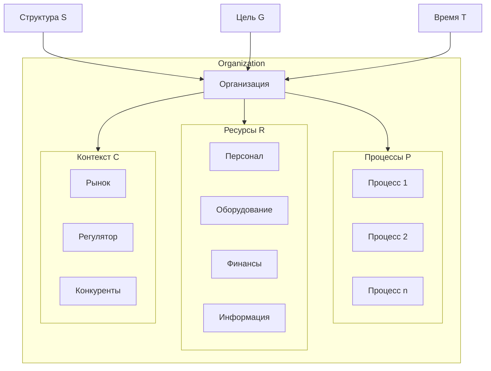
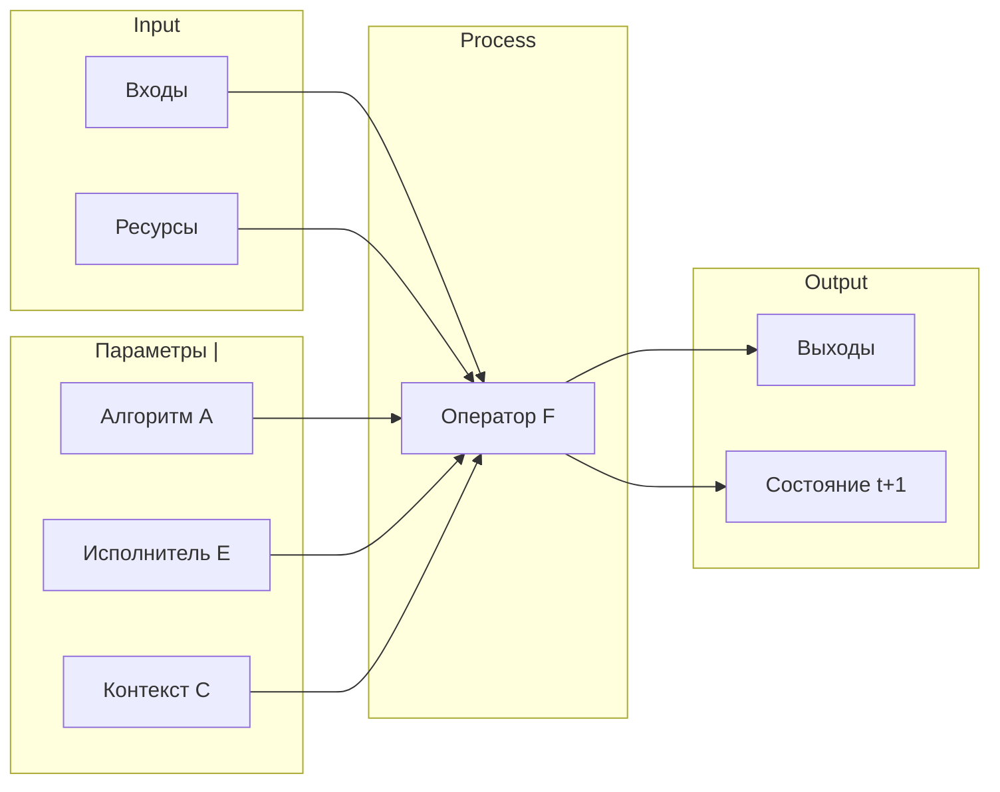
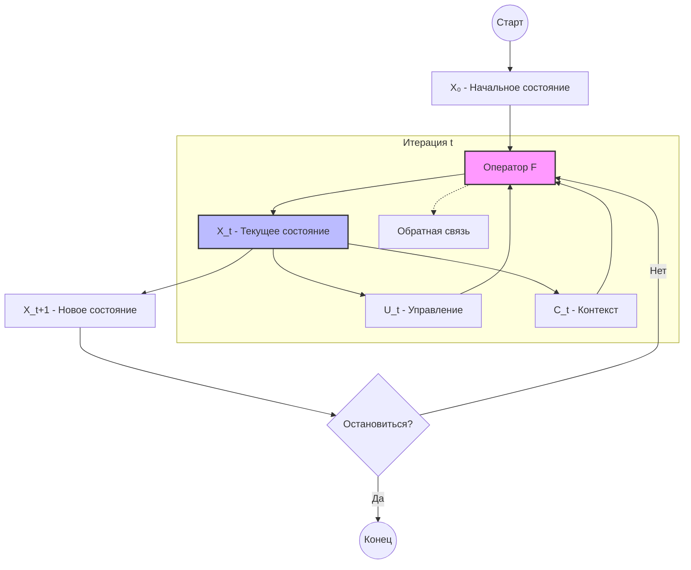

# Анализ организации на основе тензорного подхода

## Введение

Настоящий документ представляет формальную схему деятельности организации на основе процесс-центричного подхода (ПЦП) и тензорной формулировки процесса. Документ подготовлен в соответствии с требованиями issue #1 репозитория bpm-tensor.

## 1. Теоретическая база

### 1.1. Тензорная формулировка процесса

Основная формула тензорного подхода к описанию деятельности:

$$X_{t+1} = F(X_t, U_t \mid I, T)$$

где:
- $X_t$ — тензор состояния системы в момент $t$
- $X_{t+1}$ — состояние системы в момент $t+1$
- $U_t$ — тензор управляющих воздействий
- $I$ — инварианты (фиксированные параметры: структура, архитектура, роль)
- $T$ — темпоральные параметры (время, фазы)
- $F$ — оператор деятельности (тензорный оператор перехода)

### 1.2. Процесс-центричный подход (ПЦП)

Согласно ПЦП, организация представляется как совокупность процессов. Все остальные элементы организации (персонал, оборудование, финансы) являются ресурсами процессов.

## 2. Формула организации

### 2.1. Базовая формализация

На основе требований issue #1, представим **формулу организации** как расширение базовой тензорной формулы:

$$O_{t+1} = \Phi(P_t, R_t, C_t \mid S, G, T)$$

где:
- $O_{t+1}$ — состояние организации в момент $t+1$
- $P_t$ — множество процессов организации в момент $t$
- $R_t$ — ресурсы процессов в момент $t$
- $C_t$ — контекст (внешняя среда) в момент $t$
- $S$ — структура организации (инвариант)
- $G$ — телеология (цель, телос) организации
- $T$ — временные параметры

### 2.2. Детализация оператора процессов

Процесс в тензорном представлении:

$$P_i^{t+1} = F_p(P_i^t, I_i^t, R_i^t \mid A_i, \theta_i)$$

где:
- $P_i^t$ — состояние $i$-го процесса в момент $t$
- $I_i^t$ — входы процесса
- $R_i^t$ — ресурсы процесса
- $A_i$ — алгоритм (последовательность операций)
- $\theta_i$ — параметры процесса

### 2.3. Полная модель организации

## 3. Математические операторы модели

### 3.1. Основные операторы

| Оператор | Обозначение | Описание |
|----------|-------------|----------|
| Оператор процесса | $F_p$ | Трансформация входов в выходы |
| Оператор ресурсов | $F_r$ | Распределение и потребление ресурсов |
| Оператор контекста | $F_c$ | Реакция на внешние факторы |
| Оператор организации | $\Phi$ | Интеграция всех подсистем |

### 3.2. Параметры модели

| Параметр | Тип | Описание |
|----------|-----|----------|
| $X$ | Тензор состояния | Текущее состояние процессов |
| $U$ | Тензор управления | Управляющие воздействия |
| $I$ | Тензор инвариантов | Неизменные параметры |
| $T$ | Скаляр/тензор | Временные параметры |

## 4. Сравнение с существующими подходами

### 4.1. Обзор подходов

| Подход | Описание | Сходство с тензорным | Различие |
|--------|----------|---------------------|----------|
| BPM (Business Process Management) | Управление процессами | Процесс как основа | Нет формализации тензорами |
| EPC (Event-driven Process Chains) | Сети процессов | Представление потоков | Статическое представление |
| Value Stream Mapping | Картирование потоков создания ценности | Визуализация потоков | Нет математической формализации |
| TOGAF | Архитектура предприятия | Комплексный взгляд | Нет тензорной нотации |
| Six Sigma / Lean | Оптимизация процессов | Фокус на процессах | Нет многомерной модели |
| Petri Nets | Сети Петри | Дискретные состояния | Нет тензорной структуры |
| State Space Model | Модель пространства состояний | Математическая формализация | Не учитывает ПЦП |

### 4.2. Преимущества тензорного подхода

1. **Единообразие описания**: Все компоненты представляются тензорами
2. **Многомерность**: Возможность учитывать множество факторов одновременно
3. **Масштабируемость**: Легкое расширение модели
4. **Совместимость с ML**: Прямое использование тензорных вычислений

## 5. Схема формальной схемы деятельности

### 5.1. Детальная схема с обратной связью

Технические проблемы github mermaid  
Изначально `Xt --> Xtp1[X_{t+1} - Новое состояние]` - ошибка, замена на X_t+1, т.к. {} - элементы синтаксиcа mermaid (ИИ этого не знает?)

## 6. Преимущества и недостатки подхода

### 6.1. Преимущества

1. **Универсальность**: Единая нотация для всех аспектов деятельности
2. **Математическая строгость**: Формализованное описание
3. **Интегрируемость**: Легкая связь с другими моделями
4. **Динамичность**: Явное представление временной эволюции
5. **Многомерность**: Учет множества факторов

### 6.2. Недостатки и пути их устранения

| Недостаток | Путь устранения |
|------------|-----------------|
| Сложность формализации | Поэтапное уточнение модели |
| Отсутствие стандартов | Разработка нотации на основе существующих |
| Высокий порог входа | Создание упрощенных примеров и руководств |
| Сложность валидации | Использование симуляции и пи-тестов |

## 7. Ключевые проблемы математической формализации

### 7.1. Проблемы

1. **Проблема размерности**: Множество параметров создает многомерное пространство
2. **Проблема неопределенности**: Не все факторы поддаются формализации
3. **Проблема темпоральности**: Учет временных зависимостей
4. **Проблема агрегации**: Переход от микро к макро уровню
5. **Проблема обратной связи**: Циклические зависимости

### 7.2. Пути решения

1. **Иерархическая декомпозиция**: Разделение на уровни абстракции
2. **Вероятностные модели**: Учет неопределенности через статистику
3. **Рекуррентные тензоры**: Представление временных рядов
4. **Теория графов**: Моделирование связей и зависимостей
5. **Нейросетевые приближения**: Аппроксимация сложных зависимостей

## 8. Заключение

Представленная формула организации на основе тензорного подхода и процесс-центричного подхода обеспечивает:

- Формальное описание деятельности как совокупности процессов
- Математически строгую нотацию для всех компонентов
- Возможность масштабирования и расширения модели
- Интеграцию с современными вычислительными инструментами

Модель требует дальнейшей детализации на конкретных примерах применения.

---

*Документ подготовлен в рамках реализации issue #1 репозитория bpm-tensor*
*Версия: 1.0*
*Дата: 2026*
