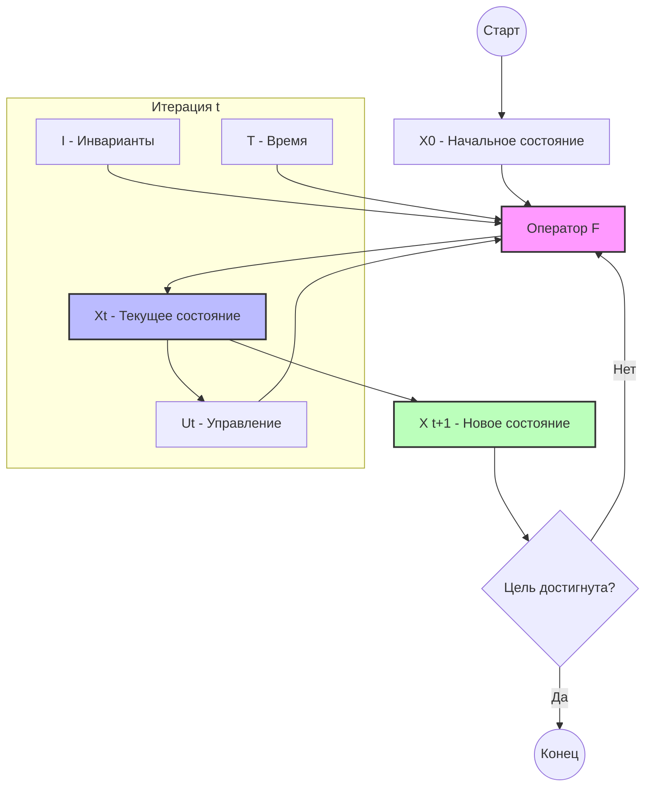

# Анализ организации на основе тензорного подхода — Версия 2

## Введение

Настоящий документ является углублённой версией `analysis_v1.md`, подготовленной в соответствии с требованиями issue #3. Архитектура процессов организации считается **статической** (алгоритмы процессов не изменяются — см. п. 2.1), поэтому формула деятельности описывает эволюцию **состояния** организации внутри фиксированной операционной модели.

---

## 1. Исходная формула и её источник

### 1.1. Оригинальная формулировка (Максим, «Tensor approach.pdf»)

Цитата из первоисточника (русскоязычный документ «Концепция тензорного описания бизнеса», автор Максим):

> Любая деятельность может быть описана уравнением:
>
> Xₜ₊₁ = F(Xₜ, Uₜ | Cₜ)
>
> где:
> - Xₜ — текущее состояние системы;
> - Uₜ — управляющие воздействия;
> - Cₜ — контекст;
> - F — оператор деятельности (архитектура, процессы, роли, память);
> - Xₜ₊₁ — новое состояние системы.

В LaTeX-нотации для GitHub:

$$X_{t+1} = F(X_t, U_t \mid C_t)$$

Это **базовая формула деятельности**. В ней оператор $F$ кодирует всю операционную архитектуру организации (процессы, роли, правила, инфраструктуру), а вертикальная черта $\mid$ отделяет динамические переменные от контекстного условия.

### 1.2. Расширенная формула для анализа

В данном документе мы используем расширенную нотацию, принятую в ver1:

$$X_{t+1} = F(X_t, U_t \mid I, T)$$

где $I$ — инварианты (статическая архитектура, алгоритмы процессов, структура ролей), $T$ — временные параметры шага.

---

## 2. Оператор «|» (вертикальная черта): смысл и пример

### 2.1. Семантика оператора

Вертикальная черта $\mid$ означает **«при зафиксированных условиях»** — то есть правая часть задаёт неизменный контекст, а левая часть описывает динамически меняющиеся аргументы. Эквивалентная запись:

$$X_{t+1} = F_{I,T}(X_t, U_t)$$

Это напрямую отражает принятое допущение о **статической архитектуре процессов**: алгоритмы $A_i$, роли $E_i$, регламенты и структура предприятия зафиксированы в $I$ и **не изменяются** от шага к шагу. Изменяются только состояние $X_t$ (объёмы запасов, нагрузка исполнителей, остатки на счетах и т.д.) и управляющие воздействия $U_t$ (планы, задания, решения).

### 2.2. Практический пример — столярный цех

Рассмотрим один производственный шаг: **раскрой брусьев** под ножки табурета.

- $X_t$ — состояние: {брус_на_складе = 50 шт., заготовок_на_раскрое = 0 шт., рабочий_свободен = true}
- $U_t$ — задание: {раскроить_заготовки = 20 шт.}
- $I$ — инварианты: {алгоритм_раскроя = «распилить брус на 4 части», норма_выработки = 10 шт./час, станок = «Jet JWS-10CS», рабочий_роль = «оператор станка»}
- $T$ — шаг: 1 рабочий час

Результат:

$$X_{t+1} = \{брус\_на\_складе = 45, заготовок = 20, рабочий\_свободен = false\}$$

Алгоритм раскроя ($I$) остался **тем же самым** — изменилось только состояние (запасы, нагрузка). Именно это и фиксирует $\mid$: F одна и та же для любых значений $X_t$ и $U_t$, а её поведение задано инвариантами $I$.

---

## 3. Декомпозиция формулы по типам потоков

Организация одновременно ведёт несколько независимо формализуемых, но взаимосвязанных потоков. Каждый из них описывается своим тензорным уравнением с собственным набором параметров.

### 3.1. Рабочий поток (Workflow)

$$W_{t+1} = F_w(W_t, U_t^w \mid A, E, \Theta_w)$$

| Параметр | Обозначение | Описание |
|----------|-------------|----------|
| Состояние рабочего потока | $W_t$ | Множество задач: {задача, статус, назначен, сроки} |
| Управление | $U_t^w$ | Запуск/остановка задач, перераспределение |
| Алгоритмы процессов | $A$ | Последовательности операций (инвариант) |
| Исполнители (люди и машины) | $E$ | Роли и их компетенции (инвариант) |
| Нагрузка исполнителей | $\lambda_E \in \Theta_w$ | Текущая загруженность каждого исполнителя [0..1] |
| Нагрузка оборудования | $\lambda_M \in \Theta_w$ | Текущая загруженность станков/оснастки [0..1] |
| Норма выработки | $\nu \in \Theta_w$ | Производительность исполнителя/машины, шт./час |
| Временной шаг | $\Delta t \in \Theta_w$ | Длина шага планирования |

**Упрощённая версия (идеальные условия — нет сбоев, равномерный поток, все ресурсы доступны):**

$$W_{t+1} = A \cdot W_t + U_t^w$$

то есть каждая задача переходит к следующей операции алгоритма $A$ при наличии управляющего воздействия $U_t^w$.

### 3.2. Документальный поток (Docflow)

$$D_{t+1} = F_d(D_t, U_t^d \mid \mathcal{R}, \mathcal{F}, \Theta_d)$$

| Параметр | Обозначение | Описание |
|----------|-------------|----------|
| Состояние документооборота | $D_t$ | Множество документов: {вид, статус, исполнитель, дата} |
| Управление | $U_t^d$ | Создание, согласование, подписание, архивирование |
| Регламенты | $\mathcal{R}$ | Нормативные требования к документам (инвариант) |
| Формы документов | $\mathcal{F}$ | Шаблоны: накладная, договор, счёт-фактура (инвариант) |
| Сроки обработки | $\tau_d \in \Theta_d$ | Нормативное время на каждый тип документа |
| Контрагенты | $K \in \Theta_d$ | Поставщики, магазины, регуляторы |

Документы, относящиеся к договорам с поставщиками и магазинами, формализуются отдельно (см. §3.5).

**Упрощённая версия:**

$$D_{t+1} = \mathcal{F}(U_t^d) \cup \{d \in D_t : статус(d) \neq завершён\}$$

### 3.3. Материальный поток (Material flow)

$$M_{t+1} = F_m(M_t, U_t^m \mid \mathcal{N}, \mathcal{S}, \Theta_m)$$

| Параметр | Обозначение | Описание |
|----------|-------------|----------|
| Состояние материального потока | $M_t$ | Запасы по номенклатуре: {материал, кол-во, место хранения} |
| Управление | $U_t^m$ | Заявки на закупку, заказ-наряды, отгрузки |
| Нормы расхода | $\mathcal{N}$ | Расход материала на единицу продукции (инвариант) |
| Структура поставок | $\mathcal{S}$ | Поставщики и их характеристики (инвариант при аутсорсинге логистики) |
| Поток снабжения | $q_{in} \in \Theta_m$ | Объём поступления материалов за период |
| Поток сбыта | $q_{out} \in \Theta_m$ | Объём отгрузки готовой продукции за период |
| Уровень запаса | $s \in \Theta_m$ | Текущий остаток (страховой, оборотный) |
| Нагрузка склада | $\lambda_S \in \Theta_m$ | Использование складских мощностей [0..1] |

**Упрощённая версия (равномерный поток, без дефицитов):**

$$M_{t+1} = M_t + q_{in} \cdot \Delta t - \mathcal{N} \cdot W_{t+1}$$

### 3.4. Финансовый поток (Financial flow)

$$\mathcal{B}_{t+1} = F_f(\mathcal{B}_t, U_t^f \mid \mathcal{T}, \mathcal{P}, \Theta_f)$$

| Параметр | Обозначение | Описание |
|----------|-------------|----------|
| Состояние финансов | $\mathcal{B}_t$ | Баланс: {расчётный счёт, дебиторка, кредиторка} |
| Управление | $U_t^f$ | Платёжные поручения, выставление счетов |
| Налоговая модель | $\mathcal{T}$ | Ставки налогов, схема УСН (инвариант) |
| Ценовая модель | $\mathcal{P}$ | Цены реализации, себестоимость (инвариант при статической архитектуре) |
| Поток выручки | $r \in \Theta_f$ | Поступления от магазинов за период |
| Поток расходов | $c \in \Theta_f$ | Оплата поставщикам, ФОТ, аренда, налоги |
| Комиссия торговой точки | $k_m \in \Theta_f$ | Доля магазина от реализации (договор комиссии) |

**Упрощённая версия:**

$$\mathcal{B}_{t+1} = \mathcal{B}_t + r \cdot (1 - k_m) - c$$

### 3.5. Связанная формула организации

Все четыре потока объединяются в единую формулу состояния организации:

$$O_{t+1} = \Phi\bigl(W_t, D_t, M_t, \mathcal{B}_t,\ U_t \mid I, T\bigr)$$

где $U_t = (U_t^w, U_t^d, U_t^m, U_t^f)$ — вектор управляющих воздействий по всем потокам, а $I$ — общий инвариант (статическая архитектура процессов, регламенты, договоры).

---

## 4. Полный перечень параметров модели

### 4.1. Параметры состояния $X_t$

| № | Параметр | Обозначение | Поток | Описание |
|---|----------|-------------|-------|----------|
| 1 | Состояние задач | $W_t$ | Workflow | Текущий статус каждой задачи (не начата / в работе / завершена) |
| 2 | Нагрузка исполнителей | $\lambda_E$ | Workflow | Загруженность каждого рабочего/роли [0..1] |
| 3 | Нагрузка оборудования | $\lambda_M$ | Workflow | Загруженность каждой единицы оборудования [0..1] |
| 4 | Состояние документов | $D_t$ | Docflow | Статус каждого документа (черновик / согласование / подписан / архив) |
| 5 | Запасы материалов | $M_t$ | Material | Количество каждого материала на складе (в натуральных единицах) |
| 6 | Запасы готовой продукции | $P_t$ | Material | Количество готовых табуреток на складе и на реализации |
| 7 | Остаток на расчётном счёте | $b$ | Financial | Денежный остаток предприятия (руб.) |
| 8 | Дебиторская задолженность | $deb$ | Financial | Долг магазинов перед предприятием (руб.) |
| 9 | Кредиторская задолженность | $cred$ | Financial | Долг предприятия перед поставщиками (руб.) |
| 10 | Состояние инструмента/оборудования | $\mu_M$ | MRO | Техническое состояние каждой единицы [0..1], где 1 — исправно |
| 11 | Состояние ИТ-систем | $\mu_{IT}$ | MRO | Доступность ИТ-инфраструктуры (аутсорс) [0..1] |

### 4.2. Параметры управления $U_t$

| № | Параметр | Поток | Описание |
|---|----------|-------|----------|
| 1 | Производственный план | Workflow | Плановое количество изделий за период |
| 2 | Заявки на материалы | Material | Количество к закупке по номенклатуре |
| 3 | Задания исполнителям | Workflow | Назначение задач с указанием исполнителя и срока |
| 4 | Платёжные поручения | Financial | Распоряжения об оплате |
| 5 | Выставленные счета | Financial | Счета поставщикам/магазинам |
| 6 | Заявки в сервисную службу | MRO | Запросы на техобслуживание (аутсорс) |

### 4.3. Инварианты $I$ (статическая архитектура процессов)

| № | Инвариант | Описание |
|---|-----------|----------|
| 1 | Алгоритмы производственных процессов | Последовательность операций: раскрой → сборка → обработка → покраска → контроль |
| 2 | Алгоритмы HR-процессов | Онбординг, плановое обучение, учёт рабочего времени (без найма/увольнения) |
| 3 | Алгоритмы MRO-процессов | Регламент планово-предупредительного обслуживания инструмента/оборудования/ИТ |
| 4 | Нормы расхода материалов | Расход материала на единицу изделия |
| 5 | Договоры с поставщиками | Условия поставки сырья (аутсорс логистики) |
| 6 | Договоры с магазинами | Условия комиссионной реализации |
| 7 | Налоговая схема | УСН, ставки, сроки |
| 8 | Регуляторные требования | ТУ на продукцию, требования охраны труда |
| 9 | Роли и компетенции | Структура должностей и зон ответственности |
| 10 | Аутсорс-контракты | Договоры с логистическим оператором, сервисной службой, ИТ-провайдером |

### 4.4. Что означает $X_{t+1}$ при статической архитектуре

При **статической архитектуре процессов** оператор $F$ не изменяется. Следовательно:

- $X_{t+1}$ — это **новое операционное состояние** (объёмы запасов, загруженность персонала и оборудования, денежные остатки, статусы документов, техническое состояние оснащения) после применения алгоритмов $A$ к состоянию $X_t$ с управляющим воздействием $U_t$.
- $X_{t+1}$ **не включает** изменения алгоритмов, ролей, структуры организации — эти характеристики закреплены в инвариантах $I$.
- Пример: если в момент $t$ склад содержит 50 брусьев, а производственный план — 20 табуреток, то $X_{t+1}$ будет содержать 40 брусьев (−10 = 20 изделий × 0.5 бруса/изделие), 20 готовых табуреток на складе и уменьшившийся остаток на расчётном счёте после выплаты ФОТ.

---

## 5. Применение формулы к предприятию «Изготовление табуреток»

### 5.1. Инициализация состояния $X_0$

| Параметр | Значение |
|----------|----------|
| Брус сосновый на складе | 200 шт. |
| Лак на складе | 10 л |
| Шурупы | 500 шт. |
| Готовая продукция | 0 шт. |
| Расчётный счёт | 300 000 руб. |
| Дебиторка | 0 руб. |
| Нагрузка рабочих (3 чел.) | 0 (нет заданий) |
| Нагрузка станка | 0 |
| Состояние инструмента | 1.0 (исправен) |

### 5.2. Управляющее воздействие $U_1$ (план на месяц)

| Параметр | Значение |
|----------|----------|
| Производственный план | 100 шт. |
| Заявка на брус | 0 (запас есть) |
| Задания рабочим | распределить по операциям |

### 5.3. Шаг формулы $X_1 = F(X_0, U_1 \mid I, T)$

| Параметр | $X_0$ | Операция | $X_1$ |
|----------|-------|----------|-------|
| Брус на складе | 200 | −100 шт. × 0.01 м³ / 0.01 м³ | 100 шт. |
| Готовая продукция | 0 | +100 шт. | 100 шт. |
| Расчётный счёт | 300 000 | −130 000 (матер.) − 117 000 (ФОТ) − 30 000 (аренда) | 23 000 руб. |
| Дебиторка | 0 | +50 000 (отгрузка в магазин) | 50 000 руб. |
| Нагрузка рабочих | 0 | 1.0 весь месяц → выполнено | 0 (задание выполнено) |

### 5.4. Документальный поток за период

| Документ | Событие | Инвариант (шаблон) |
|----------|---------|--------------------|
| Договор поставки | Подписан до начала периода | $\mathcal{F}_{договор}$ |
| Товарная накладная ТОРГ-12 | Отгрузка в магазин | $\mathcal{F}_{накладная}$ |
| Счёт-фактура | Выставлен магазину | $\mathcal{F}_{счёт}$ |
| Платёжное поручение | Оплата поставщику | $\mathcal{F}_{платёж}$ |
| Отчёт комиссионера | Получен от магазина | $\mathcal{F}_{отчёт\_ком}$ |
| Бухгалтерская проводка | Признание выручки | $\mathcal{F}_{проводка}$ |

---

## 6. Схема обратной связи

**Что такое $X_{t+1}$ в данном контексте:**

$X_{t+1}$ — вектор операционного состояния, включающий:

1. Объёмы запасов (материалы, НЗП, готовая продукция)
2. Финансовые остатки (расчётный счёт, дебиторка, кредиторка)
3. Загруженность исполнителей ($\lambda_E$) и оборудования ($\lambda_M$)
4. Статусы текущих документов ($D_t$)
5. Техническое состояние оснастки ($\mu_M$) и ИТ ($\mu_{IT}$)

Параметры **не входящие** в $X_{t+1}$ при статической архитектуре: структура процессов, алгоритмы, роли, договоры — они инварианты ($I$).

---

## 7. Математические альтернативы тензорному подходу

Ниже сравниваются **математические формализмы** (не методологии управления) для описания деятельности организации.

| Формализм | Как описывает организацию | Сходство с тензорным | Ключевое различие |
|-----------|--------------------------|---------------------|-------------------|
| **Теория множеств** | Организация как система отношений: $O = (P, R, \subseteq, \circ)$; процессы как функции на множествах | Возможность декларативной спецификации состояний | Нет явной динамики и временно́й эволюции; нет структуры «тензор» |
| **Сети Петри** | Состояние = маркировка, переходы = операции; $M_{t+1} = M_t + \Delta(t_i)$ при срабатывании перехода $t_i$ | Дискретная динамика, явная конкурентность | Скалярные токены, сложно кодировать многомерные ресурсы; нет условного параметрирования $\mid I$ |
| **Теория категорий** | Организация как категория: объекты — состояния, морфизмы — переходы; $F: \mathcal{C} \to \mathcal{C}$ — эндофунктор | Единый язык для состава функций (функторы, натуральные преобразования) | Высокий уровень абстракции; вычислительно нелегко реализовать |
| **Марковские цепи / MDP** | Вероятностный переход: $P(X_{t+1} \mid X_t, U_t)$; оптимальная политика: $\pi^*(X_t)$ | Явная случайность, оптимизация управления | Скалярное состояние или вектор; не сохраняет многомерную структуру тензора |
| **Модель пространства состояний** | $x_{t+1} = Ax_t + Bu_t$; линейная векторная динамика | Прямое математическое соответствие (частный линейный случай тензорной формулы) | Линейность; нет разделения динамических переменных и инвариантов через $\mid$ |
| **Алгебра процессов (CSP, CCS)** | Процессы как алгебраические термы; параллельная композиция $P \parallel Q$, синхронизация через каналы | Формализация параллелизма и взаимодействия | Нет многомерного состояния; сложно включить ресурсные ограничения |
| **Тензорный подход** | $X_{t+1} = F(X_t, U_t \mid I, T)$; все объекты — тензоры произвольного ранга | — | Единая нотация для многомерных потоков; явное разделение динамики и инвариантов; совместимость с ML/GPU |

### 7.1. Преимущества тензорного подхода перед альтернативами

1. **Многомерность из коробки** — Сети Петри и MDP требуют кодировать размерность вручную; тензоры несут её структурно.
2. **Разделение динамики и архитектуры** — оператор $\mid$ явно фиксирует, что меняется (состояние) и что статично (алгоритмы). Ни одна из альтернатив не имеет такого чёткого механизма «замороженного контекста».
3. **Вычислительная реализуемость** — PyTorch/TensorFlow/JAX позволяют напрямую оптимизировать тензорные модели. Категорный подход хорош теоретически, но вычислительно сложен.
4. **Масштабирование** — добавить новый поток (материальный, документальный) значит добавить компоненту в тензор состояния $X_t$, не переписывая оператор $F$.

---

## 8. Преимущества и недостатки подхода

### 8.1. Преимущества

1. **Единообразие описания**: все потоки (workflow, docflow, material, financial) описаны единой нотацией
2. **Разделение архитектуры и состояния**: через $\mid I$ чётко разграничены, что статично (процессы) и что динамично (данные)
3. **Масштабируемость**: добавление нового потока — добавление компоненты тензора
4. **Совместимость с ML**: формула прямо соответствует рекуррентным нейронным сетям

### 8.2. Недостатки и пути их устранения

| Недостаток | Путь устранения |
|------------|-----------------|
| Высокий порог входа для практиков | Упрощённые версии формул (см. §3.1–§3.4) + примеры на табуретках |
| Сложность валидации тензорной модели | Симуляция на Python/NumPy; пошаговое воспроизведение шагов |
| Нет устоявшегося стандарта нотации | Разработать нотационный словарь на основе настоящего документа |
| Неопределённость при сбоях (дефицит материала, поломка) | Расширить $X_t$ флагами сбоев; ввести стохастическую поправку |

---

## 9. Ключевые проблемы математической формализации

### 9.1. Проблемы

1. **Размерность**: организация как тензор высокого ранга — вычислительно дорого
2. **Нелинейность**: реальный $F$ не линеен (очереди, дефицит, задержки)
3. **Дискретность событий**: поступление партии материалов — дискретное событие в непрерывной формуле
4. **Агрегация уровней**: микро (одна задача) → макро (весь завод)
5. **Задержки**: документ может «висеть» несколько периодов

### 9.2. Пути решения

1. **Иерархическая декомпозиция**: отдельный $F$ для каждого уровня (операция → процесс → предприятие)
2. **Гибридные модели**: тензор + событийная сеть (для дискретных событий)
3. **Рекуррентные тензоры**: для задержек использовать $X_t$ с памятью предыдущих периодов
4. **Нейросетевое приближение**: при неизвестном $F$ — обучить на исторических данных

---

## 10. Заключение

Представленная в данном документе расширенная тензорная модель обеспечивает:

- **Декомпозицию** организации на четыре взаимосвязанных потока (workflow, docflow, material, financial)
- **Полный перечень параметров** состояния $X_t$ и управления $U_t$ с чёткой классификацией
- **Разъяснение** смысла оператора $\mid$ и $X_{t+1}$ при статической архитектуре процессов
- **Сравнение** с математическими альтернативами (теория множеств, сети Петри, теория категорий, MDP)
- **Практический пример** применения к предприятию «Изготовление табуреток»

---

*Документ подготовлен в рамках реализации issue #3 репозитория bpm-tensor*  
*Версия: 2.0*  
*Дата: 2026*
