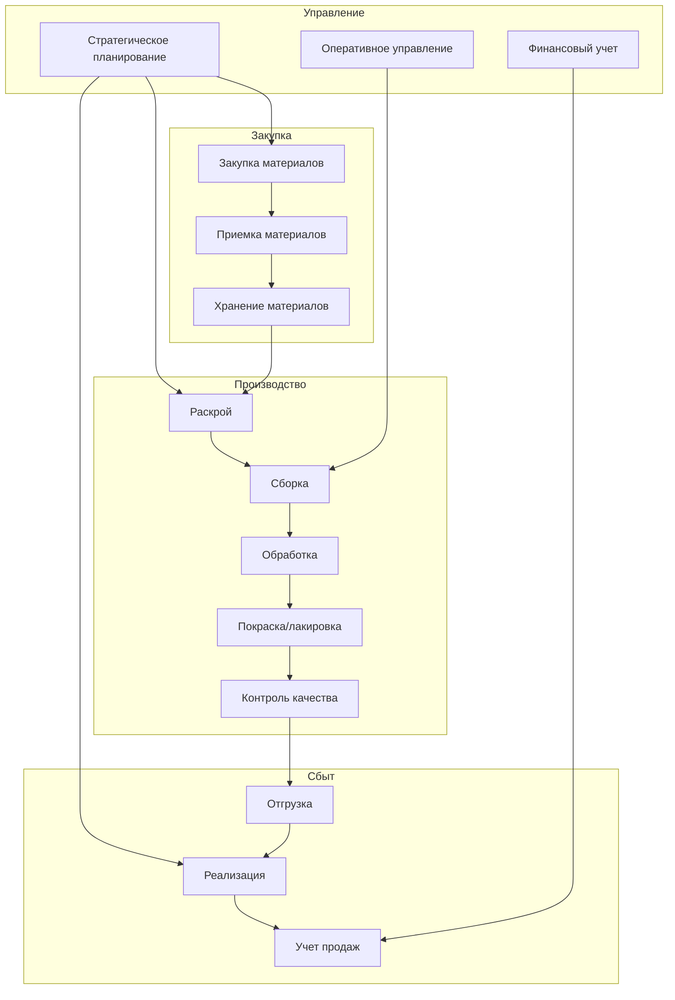
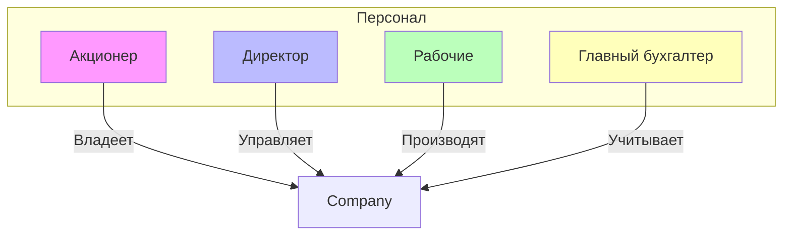
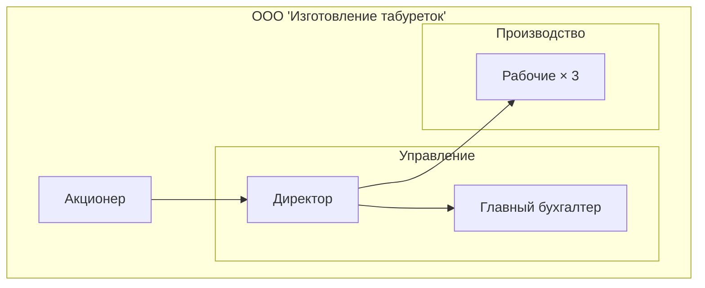
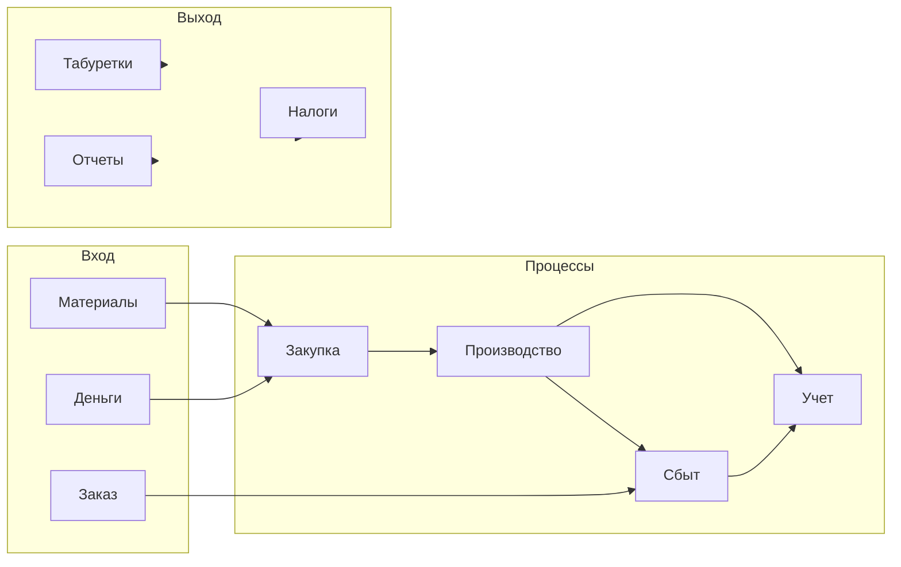

# Enterprise Architecture: ООО «Изготовление табуреток»

## Введение

Настоящий документ представляет подробную архитектуру предприятия «Изготовление табуреток» в соответствии с требованиями issue #1. Предприятие специализируется на производстве одного вида продукции — «Табурет Обыкновенный».

## 1. Общее описание предприятия

### 1.1. Основные параметры

| Параметр | Значение |
|----------|----------|
| Наименование | ООО «Изготовление табуреток» |
| Форма собственности | Общество с ограниченной ответственностью |
| Система налогообложения | Упрощенная (УСН 6% или 15%) |
| Вид деятельности | Производство мебели |
| Продукт | Табурет Обыкновенный |
| Канал сбыта | Магазины (договор на реализацию) |

### 1.2. Участники

| Роль | Функция |
|------|---------|
| Акционер | Собственник, принимает стратегические решения |
| Директор | Управление операционной деятельностью |
| Рабочие | Производство табуреток |
| Главный бухгалтер | Бухгалтерский и налоговый учет |

## 2. Архитектура процессов

### 2.1. Карта процессов (AS-IS)

### 2.2. Детальное описание процессов

#### 2.2.1. Процесс: Закупка материалов

| Шаг | Описание | Результат | Исполнитель |
|-----|----------|-----------|--------------|
| 1.1 | Определение потребности | Заявка на материалы | Директор |
| 1.2 | Поиск поставщиков | Список поставщиков | Директор |
| 1.3 | Сравнение цен | Коммерческое предложение | Директор |
| 1.4 | Размещение заказа | Договор поставки | Директор |
| 1.5 | Оплата | Платежное поручение | Главный бухгалтер |

#### 2.2.2. Процесс: Производство

| Шаг | Описание | Результат | Исполнитель |
|-----|----------|-----------|--------------|
| 2.1 | Раскрой материалов | Заготовки | Рабочие |
| 2.2 | Сборка каркаса | Каркас табурета | Рабочие |
| 2.3 | Обработка поверхностей | Зашлифованные детали | Рабочие |
| 2.4 | Покраска/лакировка | Готовый вид | Рабочие |
| 2.5 | Контроль качества | Соответствие ТУ | Рабочие/Директор |

#### 2.2.3. Процесс: Сбыт

| Шаг | Описание | Результат | Исполнитель |
|-----|----------|-----------|--------------|
| 3.1 | Отгрузка в магазины | Накладная | Директор |
| 3.2 | Реализация | Отчет магазина | Магазин |
| 3.3 | Учет продаж | Приходный ордер | Главный бухгалтер |

## 3. Тензорная формализация предприятия

### 3.1. Состояние предприятия

$$O_t = (P_t, R_t, C_t)$$

где:
- $P_t$ — состояние процессов в момент $t$
- $R_t$ — состояние ресурсов в момент $t$
- $C_t$ — контекст (внешняя среда) в момент $t$

### 3.2. Оператор предприятия

$$O_{t+1} = \Phi(O_t, U_t \mid S, G)$$

где:
- $S$ — структура организации (инвариант)
- $G$ — цель организации (телос)
- $U_t$ — управляющие воздействия

### 3.3. Параметры предприятия «Табуретка»

| Параметр | Обозначение | Значение |
|----------|-------------|----------|
| Производственная мощность | $M$ | 100 шт./месяц |
| Цена реализации | $P$ | 500 руб. |
| Себестоимость | $C$ | 300 руб. |
| Количество рабочих | $W$ | 3 чел. |
| Фонд оплаты труда | $F$ | 90 000 руб./мес. |
| Аренда | $A$ | 30 000 руб./мес. |

### 3.4. Математическая модель выручки

$$R = N \times P \times (1 - K_m)$$

где:
- $R$ — выручка
- $N$ — количество реализованных табуреток
- $P$ — цена
- $K_m$ — комиссия магазина (обычно 15-20%)

### 3.5. Модель прибыли (УСН)

$$Pr = R - C_{prod} - A - F - O_{ex} - Tax$$

При УСН 6% (доходы):
$$Tax = R \times 0.06$$

При УСН 15% (доходы минус расходы):
$$Tax = (R - Expenses) \times 0.15$$

## 4. Структура ресурсов

### 4.1. Человеческие ресурсы

| Роль | ЗП (мес.) | Функции |
|------|-----------|---------|
| Аакционер | Дивиденды | Собственность, стратегия |
| Директор | 50 000 руб. | Оперативное управление |
| Рабочие (3 чел.) | 30 000 руб. × 3 | Производство |
| Главный бухгалтер | 40 000 руб. | Бухгалтерия |

### 4.2. Материальные ресурсы

| Ресурс | Количество | Стоимость |
|--------|------------|-----------|
| Станок деревообрабатывающий | 2 шт. | 100 000 руб. |
| Верстак | 3 шт. | 30 000 руб. |
| Инструменты | комплект | 20 000 руб. |
| Краскопульт | 1 шт. | 10 000 руб. |

### 4.3. Материальные затраты на 1 табурет

| Материал | Расход | Цена | Стоимость |
|----------|--------|------|-----------|
| Брус сосновый | 0.01 м³ | 10 000 руб./м³ | 100 руб. |
| Лак | 0.05 л | 400 руб./л | 20 руб. |
| Шурупы | 10 шт. | 1 руб. | 10 руб. |
| **Итого** | | | **130 руб.** |

## 5. Финансовая архитектура

### 5.1. Смета доходов и расходов (месяц)

| Статья | Сумма (руб.) |
|--------|--------------|
| **Доходы** | |
| Выручка от реализации (100 шт. × 500 руб.) | 50 000 |
| **Расходы** | |
| Материалы (100 × 130) | 13 000 |
| ФОТ (90 000 + 30% налоги) | 117 000 |
| Аренда | 30 000 |
| Коммунальные услуги | 5 000 |
| Прочие расходы | 10 000 |
| **Итого расходы** | **175 000** |
| **Убыток** | **(125 000)** |

### 5.2. Оптимизация

Для достижения прибыльности необходимо:

| Параметр | Текущее | Целевое |
|----------|---------|---------|
| Объем производства | 100 шт. | 500 шт. |
| Цена реализации | 500 руб. | 500 руб. |
| Себестоимость | 300 руб. | 250 руб. |

$$Profit = 500 \times N - (130N + 175000)$$

Прибыль при 500 шт.:
$$Profit = 500 \times 500 - (130 \times 500 + 175000) = 250000 - 80000 = 170000$$

## 6. Организационная структура

## 7. Схема информационных потоков

## 8. Юридическая схема

### 8.1. Договор на реализацию

| Параметр | Описание |
|----------|----------|
| Вид договора | Договор комиссии |
| Комиссия | 15-20% от реализации |
| Право собственности | Переходит при реализации |
| Возврат | Нереализованный товар возвращается |

### 8.2. Налогообложение (УСН)

| Параметр | Значение |
|----------|----------|
| Объект | Доходы или доходы-расходы |
| Ставка | 6% или 15% |
| Лимит доходов | 265,8 млн руб. (2024) |
| Страховые взносы | 30% от ФОТ |

## 9. Показатели эффективности

### 9.1. KPI предприятия

| Показатель | Формула | Целевое значение |
|------------|---------|------------------|
| Объем производства | шт./месяц | 500 |
| Выручка | руб./месяц | 250 000 |
| Себестоимость | руб./шт. | 250 |
| Рентабельность | (Pr/R) × 100% | 30% |
| Фондоотдача | R / ОФ | 2.5 |

### 9.2. Тензорная форма KPI

$$KPI_t = f(X_t, U_t \mid G)$$

где:
- $X_t$ — текущие показатели
- $U_t$ — управляющие воздействия
- $G$ — целевые значения

## 10. Риски и их учет

| Риск | Вероятность | Влияние | Мера снижения |
|------|-------------|---------|---------------|
| Снижение спроса | Высокая | Высокое | Диверсификация |
| Рост цен на материалы | Средняя | Среднее | Долгосрочные контракты |
| Потеря квалифицированных рабочих | Средняя | Высокое | Стимулирование |
| Изменение налогового законодательства | Низкая | Высокое | Мониторинг |

## 11. Заключение

Представленная Enterprise Architecture предприятия «Изготовление табуреток» демонстрирует применение тензорного подхода к формализации деятельности организации. Модель включает:

1. **Процессную модель**: полная карта процессов от закупки до сбыта
2. **Ресурсную модель**: человеческие, материальные и финансовые ресурсы
3. **Математическую модель**: тензорные формулы для расчета показателей
4. **Финансовую модель**: бюджет и оптимизация
5. **Организационную структуру**: роли и взаимосвязи

Модель может быть расширена для учета дополнительных факторов и сценариев развития.

---

*Документ подготовлен в рамках реализации issue #1 репозитория bpm-tensor*
*Пример применения тензорной формулы организации*
*Версия: 1.0*