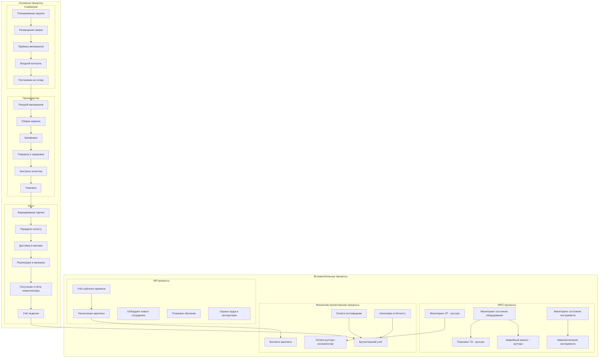
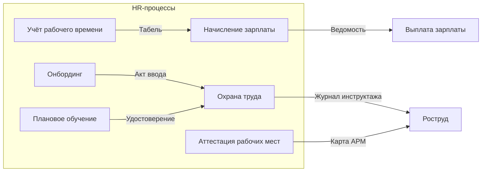
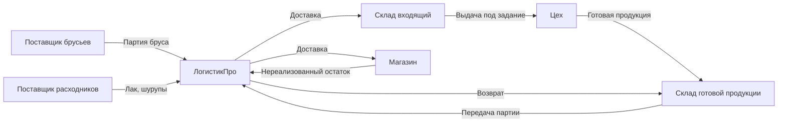
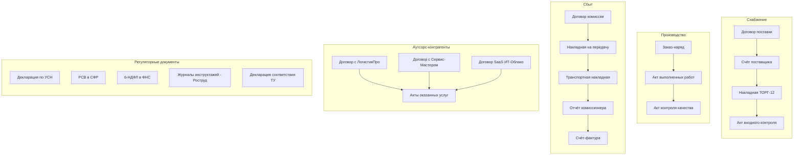
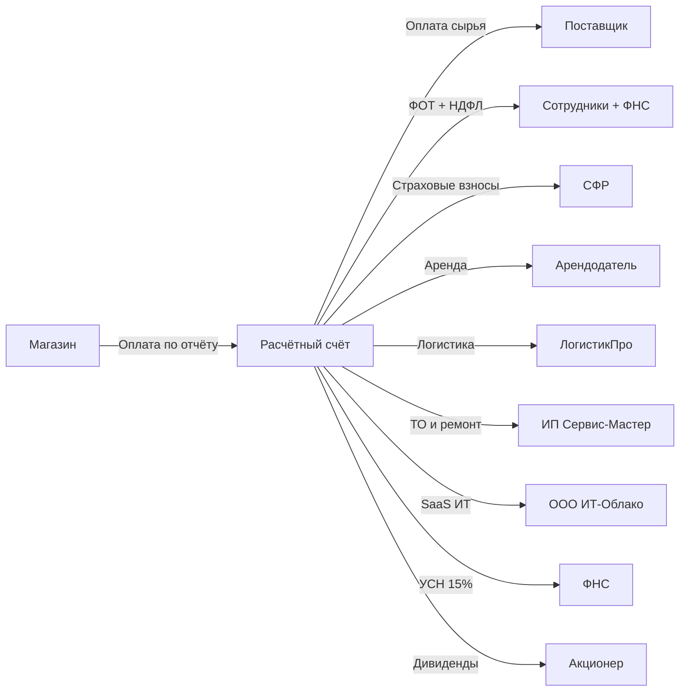
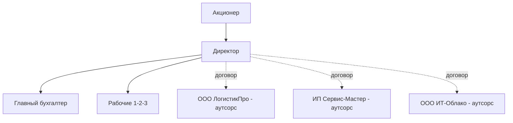

# Enterprise Architecture v2: ООО «Изготовление табуреток»

## Введение

Настоящий документ является расширенной версией `architecture_v1.md`. Ключевые изменения по сравнению с v1:

- **Логистика** — на аутсорсинге (логистический оператор)
- **Техническое обслуживание оборудования и инструмента** — на аутсорсинге (сервисная служба)
- **ИТ-система** — на аутсорсинге (ИТ-провайдер)
- Детализированы **HR-процессы** (без найма/увольнения), **MRO-процессы**, потоки **документов**, **материалов** и **финансов**
- Включены **договорные отношения** с поставщиками, магазинами, логистическим оператором, сервисной службой, ИТ-провайдером и регуляторами
- Добавлены **регуляторные документальные потоки**
- Диаграммы Mermaid приведены без `{}` в именах узлов

---

## 1. Общее описание предприятия

### 1.1. Основные параметры

| Параметр | Значение |
|----------|----------|
| Наименование | ООО «Изготовление табуреток» |
| Форма собственности | ООО |
| Система налогообложения | УСН 15% (доходы минус расходы) |
| Вид деятельности | Производство мебели (ОКВЭД 31.01) |
| Продукт | Табурет Обыкновенный |
| Канал сбыта | Магазины (договор комиссии) |
| Логистика | Аутсорсинг — ООО «ЛогистикПро» |
| Техобслуживание | Аутсорсинг — ИП Сервис-Мастер |
| ИТ-система | Аутсорсинг — ООО «ИТ-Облако» |

### 1.2. Участники

| Роль | Функция | Тип |
|------|---------|-----|
| Акционер | Собственник, стратегические решения | Внутренний |
| Директор | Операционное управление | Внутренний |
| Рабочий 1–3 | Производство | Внутренний |
| Главный бухгалтер | Учёт и отчётность | Внутренний |
| Поставщик древесины | Поставка брусьев | Внешний |
| Поставщик расходников | Лак, шурупы, наждачная бумага | Внешний |
| Магазин (комиссионер) | Реализация продукции | Внешний |
| ООО «ЛогистикПро» | Транспортировка материалов и продукции | Аутсорс |
| ИП Сервис-Мастер | ТО и ремонт оборудования/инструмента | Аутсорс |
| ООО «ИТ-Облако» | Поддержка 1С и IT-инфраструктуры | Аутсорс |
| ФНС | Налоговый контроль | Регулятор |
| Роструд | Контроль трудового законодательства | Регулятор |
| Роспотребнадзор | Контроль качества продукции (ТУ) | Регулятор |

---

## 2. Карта процессов (AS-IS, полная)

---

## 3. Детальное описание процессов

### 3.1. Снабжение

| Шаг | Описание | Результат | Исполнитель | Документ |
|-----|----------|-----------|-------------|----------|
| SU1 | Определение потребности по нормам расхода | Заявка на материалы | Директор | Внутренняя заявка |
| SU2 | Размещение заказа у поставщика (по договору) | Подтверждение заказа | Директор | Счёт поставщика |
| SU3 | Приёмка партии от логистического оператора | Факт поступления | Рабочий / Директор | Товарная накладная ТОРГ-12 |
| SU4 | Входной контроль: соответствие ТУ (размеры, влажность бруса) | Акт входного контроля | Рабочий / Директор | Акт приёмки |
| SU5 | Постановка на склад, пересчёт запасов | Обновление учёта | Директор | Приходный ордер М-4 |

**Договорные отношения с поставщиками:**

| Параметр | Поставщик древесины | Поставщик расходников |
|----------|--------------------|-----------------------|
| Вид договора | Договор поставки | Договор поставки |
| Частота поставок | 1 раз в месяц | 1 раз в квартал |
| Условия оплаты | Постоплата 10 дней | Предоплата 100% |
| Логистика | Аутсорс (ООО «ЛогистикПро») | Аутсорс (ООО «ЛогистикПро») |
| Документы | Договор, счёт, накладная, СФ | Договор, счёт, накладная |

### 3.2. Производство

| Шаг | Описание | Результат | Исполнитель | Инструмент/Оборудование |
|-----|----------|-----------|-------------|------------------------|
| PR1 | Раскрой бруса по чертежу: 4 ножки + 1 сиденье | Заготовки | Рабочий 1 | Торцовочный станок Jet JWS-10CS |
| PR2 | Сборка каркаса: соединение ножек со стрингерами на шурупах | Каркас | Рабочий 2 | Верстак, шуруповёрт |
| PR3 | Шлифовка всех поверхностей (зернистость 80 → 120 → 180) | Гладкие детали | Рабочий 3 | Шлифмашина, наждачная бумага |
| PR4 | Нанесение 2 слоёв лака с промежуточной сушкой (2 ч.) | Лакированный табурет | Рабочий 3 | Краскопульт |
| PR5 | Контроль качества: осмотр, проверка прочности (нагрузка 120 кг) | Табурет соответствует ТУ | Директор | Весовой тест |
| PR6 | Упаковка в стретч-плёнку + этикетка со штрих-кодом | Упакованная единица | Рабочий 1 | Стретч-обмотчик |

### 3.3. Сбыт и договорные отношения с магазинами

| Шаг | Описание | Результат | Исполнитель | Документ |
|-----|----------|-----------|-------------|----------|
| SA1 | Формирование партии по заказу магазина | Список к отгрузке | Директор | Внутренний заказ-наряд |
| SA2 | Передача партии логистическому оператору | Акт передачи | Директор / Рабочий | Товарная накладная ТОРГ-12 |
| SA3 | Доставка в магазин силами ООО «ЛогистикПро» | Товар у комиссионера | Логист (аутсорс) | ТТН |
| SA4 | Реализация конечному покупателю | Выручка комиссионера | Магазин | Кассовый чек |
| SA5 | Магазин предоставляет отчёт комиссионера (раз в месяц) | Сведения о продажах | Магазин | Отчёт комиссионера |
| SA6 | Признание выручки, выставление счёта-фактуры | Учётная запись | Главный бухгалтер | Счёт-фактура, бухгалтерская проводка |

**Договор комиссии с магазином:**

| Параметр | Значение |
|----------|----------|
| Вид договора | Договор комиссии (ГК РФ, гл. 51) |
| Комиссионное вознаграждение | 20% от цены реализации |
| Право собственности | Остаётся у ООО до момента реализации |
| Возврат нереализованного | В течение 30 дней по требованию |
| Отчётность | Отчёт комиссионера раз в месяц |
| Документы | Договор комиссии, накладная на передачу, отчёт, счёт-фактура |

---

## 4. HR-процессы (без найма и увольнения)

### 4.1. Карта HR-процессов

### 4.2. Детальное описание HR-процессов

#### 4.2.1. Учёт рабочего времени

| Шаг | Описание | Результат | Документ |
|-----|----------|-----------|----------|
| 1 | Ежедневная отметка прихода/ухода | Записи явки | Табель Т-12 |
| 2 | Учёт сверхурочных часов | Список переработок | Приказ о сверхурочной работе |
| 3 | Закрытие табеля в конце месяца | Итоговый табель | Табель Т-12 подписанный |

#### 4.2.2. Начисление и выплата заработной платы

| Шаг | Описание | Документ |
|-----|----------|----------|
| 1 | Расчёт начислений по тарифной сетке | Расчётный лист |
| 2 | Расчёт удержаний (НДФЛ 13%, алименты) | Расчётная ведомость Т-51 |
| 3 | Расчёт страховых взносов (30% ФОТ) | Ведомость по взносам |
| 4 | Перечисление на карты сотрудников | Платёжное поручение |
| 5 | Уплата НДФЛ и взносов в ФНС/СФР | Платёжное поручение |

#### 4.2.3. Онбординг нового сотрудника

| Шаг | Описание | Документ |
|-----|----------|----------|
| 1 | Оформление трудового договора | Трудовой договор |
| 2 | Вводный инструктаж по ОТ | Журнал вводного инструктажа |
| 3 | Первичный инструктаж на рабочем месте | Журнал первичного инструктажа |
| 4 | Стажировка (3–5 дней рядом с опытным рабочим) | Акт стажировки |
| 5 | Допуск к самостоятельной работе | Приказ о допуске |

#### 4.2.4. Плановое обучение и повышение квалификации

| Вид обучения | Периодичность | Документ | Регулятор |
|-------------|--------------|----------|-----------|
| Повторный инструктаж по ОТ | 1 раз в 6 месяцев | Журнал инструктажей | Роструд |
| Обучение по электробезопасности (гр. II) | 1 раз в год | Удостоверение | Ростехнадзор |
| Обучение работе с лакокрасочными материалами | При изменении ТУ | Акт обучения | Роспотребнадзор |

#### 4.2.5. Охрана труда

| Шаг | Описание | Документ |
|-----|----------|----------|
| 1 | Аттестация рабочих мест (1 раз в 5 лет) | Карта аттестации рабочего места |
| 2 | Обеспечение СИЗ (перчатки, очки, респиратор) | Карточка выдачи СИЗ |
| 3 | Расследование несчастных случаев (при наличии) | Акт Н-1 |
| 4 | Ежегодный медосмотр рабочих | Заключение медкомиссии |

### 4.3. Ресурс «Исполнитель» в тензорной модели

Каждый исполнитель (человек) описывается вектором:

$$E_i = (\lambda_i, \kappa_i, \sigma_i, h_i)$$

где:
- $\lambda_i \in [0,1]$ — текущая загруженность
- $\kappa_i$ — вектор компетенций (набор освоенных операций)
- $\sigma_i$ — статус (активен / в отпуске / на больничном)
- $h_i$ — отработанные часы за период (для расчёта ФОТ)

Тензор персонала: $E_t = [E_1, E_2, \ldots, E_n]$ — матрица $n \times 4$.

---

## 5. MRO-процессы (техническое обслуживание и ремонт)

Логистика, обслуживание оборудования и ИТ **переданы на аутсорсинг**. Предприятие выступает **заказчиком**, а не исполнителем этих работ.

### 5.1. Карта MRO-процессов

```mermaid
flowchart TB
    subgraph Monitoring [Мониторинг состояния]
        direction TB
        MON1[Ежедневная проверка оборудования]
        MON2[Ежедневная проверка инструмента]
        MON3[Мониторинг ИТ-систем - аутсорс]
    end

    subgraph Planned [Плановое ТО - аутсорс]
        direction TB
        PLN1[Составление графика ТО]
        PLN2[Заявка в ИП Сервис-Мастер]
        PLN3[Проведение ТО станка]
        PLN4[Акт выполненных работ]
        PLN5[Оплата услуг сервиса]
    end

    subgraph Emergency [Аварийный ремонт - аутсорс]
        direction TB
        EMR1[Обнаружение неисправности]
        EMR2[Вывод оборудования из эксплуатации]
        EMR3[Заявка аварийного ремонта]
        EMR4[Прибытие мастера - аутсорс]
        EMR5[Ремонт и тест]
        EMR6[Возврат в эксплуатацию]
    end

    subgraph ToolMRO [Инструментальное хозяйство]
        direction TB
        TL1[Журнал состояния инструмента]
        TL2[Списание непригодного]
        TL3[Закупка нового инструмента]
    end

    MON1 --> PLN1
    MON1 --> EMR1
    MON2 --> TL1
    MON3 --> EMR3

    PLN1 --> PLN2 --> PLN3 --> PLN4 --> PLN5
    EMR1 --> EMR2 --> EMR3 --> EMR4 --> EMR5 --> EMR6
    TL1 --> TL2 --> TL3
```

### 5.2. Плановое техническое обслуживание оборудования

| Оборудование | Вид ТО | Периодичность | Исполнитель | Документы |
|-------------|--------|--------------|-------------|-----------|
| Станок Jet JWS-10CS | Замена масла, проверка ремней | 1 раз в 3 месяца | ИП Сервис-Мастер | Акт ТО, акт сдачи-приёмки |
| Шлифмашина | Проверка щёток, замена диска | 1 раз в месяц | Рабочий (самообслуживание) | Журнал проверки |
| Краскопульт | Промывка системы, замена фильтра | После каждого использования | Рабочий 3 | Журнал |

### 5.3. Состояние оборудования в тензорной модели

Каждая единица оборудования:

$$M_j = (\mu_j, \tau_j^{TO}, \tau_j^{ресурс})$$

где:
- $\mu_j \in [0,1]$ — техническое состояние (1 = полностью исправно)
- $\tau_j^{TO}$ — дней до следующего планового ТО
- $\tau_j^{ресурс}$ — остаточный ресурс (мото-часы или годы до списания)

Тензор оборудования: $\mathbf{M}_t = [M_1, M_2, \ldots, M_k]$ — матрица $k \times 3$.

### 5.4. Мониторинг ИТ-систем (аутсорсинг ООО «ИТ-Облако»)

| ИТ-компонент | Функция | SLA | Документ |
|-------------|---------|-----|----------|
| 1С:Бухгалтерия (облако) | Бухучёт, налоговая отчётность | Доступность 99% | Договор SaaS |
| Облачный склад | Учёт материалов и продукции | Доступность 99% | Договор SaaS |
| Корпоративная почта | Коммуникации | Доступность 99.5% | Договор SaaS |

При недоступности ИТ ($\mu_{IT} < 0.5$) документооборот переводится в бумажный режим.

### 5.5. Инструментальное хозяйство (два ключевых ресурса ПЦП)

Согласно подходу ПЦП, у каждого процесса есть два ключевых ресурса:

1. **Исполнитель** ($E_i$) — человек или автоматизированный агент
2. **Оснастка** ($M_j$) — инструмент, станок, ИТ-система

| Инструмент | Тип | Состояние | Норма обслуживания | Ресурс ПЦП |
|-----------|-----|-----------|-------------------|------------|
| Шуруповёрт (3 шт.) | Ручной | ежедневная проверка аккумулятора | Замена через 2 года | Оснастка |
| Ручная пила | Ручной | осмотр зубьев еженедельно | Заточка по необходимости | Оснастка |
| Рулетка, угольник | Измерит. | ежемесячная поверка | Замена при повреждении | Оснастка |
| Торцовочный станок | Стационар. | ТО раз в квартал (аутсорс) | 10 лет | Оснастка |
| 1С (облако) | ИТ | мониторинг ООО «ИТ-Облако» | Договор SaaS | Оснастка |

---

## 6. Тензорная формализация предприятия (полная)

### 6.1. Полный вектор состояния $X_t$

$$X_t = (W_t,\ D_t,\ M_t^{mat},\ \mathcal{B}_t,\ E_t,\ \mathbf{M}_t^{equip},\ \mu_{IT})$$

| Компонента | Обозначение | Размерность | Описание |
|-----------|-------------|-------------|----------|
| Рабочий поток | $W_t$ | $n_{tasks} \times 4$ | Задачи: процесс, статус, исполнитель, срок |
| Документальный поток | $D_t$ | $n_{docs} \times 5$ | Документы: вид, статус, контрагент, дата, сумма |
| Материальные запасы | $M_t^{mat}$ | $n_{mat} \times 2$ | Номенклатура: кол-во, местонахождение |
| Финансы | $\mathcal{B}_t$ | $3$ | Расчётный счёт, дебиторка, кредиторка |
| Персонал | $E_t$ | $n_{emp} \times 4$ | Сотрудники: загруженность, компетенции, статус, часы |
| Оборудование | $\mathbf{M}_t^{equip}$ | $n_{equip} \times 3$ | Состояние, срок до ТО, ресурс |
| ИТ-система | $\mu_{IT}$ | $1$ | Доступность ИТ-аутсорса [0..1] |

### 6.2. Формула перехода

$$X_{t+1} = \Phi(X_t, U_t \mid I, T)$$

где $I$ — инварианты (статическая архитектура):

$$I = (A_{proc},\ E_{roles},\ \mathcal{N}_{mat},\ \mathcal{C}_{supply},\ \mathcal{C}_{sales},\ \mathcal{C}_{log},\ \mathcal{C}_{srv},\ \mathcal{C}_{IT},\ \mathcal{T}_{tax},\ \mathcal{R}_{reg})$$

| Инвариант | Описание |
|-----------|----------|
| $A_{proc}$ | Алгоритмы производственных процессов |
| $E_{roles}$ | Роли и компетенции персонала |
| $\mathcal{N}_{mat}$ | Нормы расхода материалов |
| $\mathcal{C}_{supply}$ | Договоры с поставщиками |
| $\mathcal{C}_{sales}$ | Договор комиссии с магазинами |
| $\mathcal{C}_{log}$ | Договор с логистическим оператором |
| $\mathcal{C}_{srv}$ | Договор с сервисной службой (ТО/ремонт) |
| $\mathcal{C}_{IT}$ | Договор SaaS с ИТ-провайдером |
| $\mathcal{T}_{tax}$ | Налоговая схема УСН 15% |
| $\mathcal{R}_{reg}$ | Регуляторные требования (ТУ, ОТ, ФНС) |

---

## 7. Потоки документов, материалов и финансов

### 7.1. Полная схема материального потока

### 7.2. Полная схема документального потока

### 7.3. Схема финансового потока

---

## 8. Организационная структура

---

## 9. Регуляторные требования и документальные потоки

### 9.1. ФНС (налоговый орган)

| Документ | Периодичность | Срок | Ответственный |
|----------|--------------|------|---------------|
| Декларация по УСН | Ежегодно | 25 марта | Главный бухгалтер |
| Уплата авансовых платежей УСН | Ежеквартально | 25-е число месяца после квартала | Главный бухгалтер |
| 6-НДФЛ | Ежеквартально | Последний день месяца после квартала | Главный бухгалтер |
| РСВ (расчёт страховых взносов) | Ежеквартально | 25-е число | Главный бухгалтер |
| Книга доходов и расходов | Ежегодно (по запросу) | По требованию | Главный бухгалтер |

### 9.2. Роструд (трудовая инспекция)

| Документ | Периодичность | Хранение |
|----------|--------------|----------|
| Журналы вводных и повторных инструктажей | Постоянно | 5 лет |
| Карточки выдачи СИЗ | Постоянно | 5 лет |
| Протоколы аттестации рабочих мест | 1 раз в 5 лет | 10 лет |
| Заключения медосмотров | Ежегодно | 5 лет |

### 9.3. Роспотребнадзор (качество продукции)

| Документ | Описание |
|----------|----------|
| Технические условия (ТУ) на Табурет Обыкновенный | Стандарт качества: размеры, нагрузка, покрытие |
| Декларация соответствия | Подтверждение соответствия ТУ, срок 3 года |

---

## 10. Финансовая архитектура (детализированная)

### 10.1. Смета доходов и расходов (месяц, 100 изделий)

| Статья | Расчёт | Сумма (руб.) |
|--------|--------|--------------|
| **Доходы** | | |
| Выручка (100 шт. × 500 руб. × (1 − 0.20 комиссия)) | 100 × 500 × 0.80 | 40 000 |
| **Расходы** | | |
| Брус (100 × 0.01 м³ × 10 000 руб./м³) | | 10 000 |
| Лак (100 × 0.05 л × 400 руб./л) | | 2 000 |
| Шурупы (100 × 10 шт. × 1 руб.) | | 1 000 |
| ФОТ брутто (3 × 30 000) | | 90 000 |
| Страховые взносы (90 000 × 30%) | | 27 000 |
| Аренда производственного помещения | | 30 000 |
| Коммунальные услуги | | 5 000 |
| Логистика (ООО «ЛогистикПро») | | 8 000 |
| ТО оборудования (ИП Сервис-Мастер, ежеквартально / 3) | | 3 333 |
| ИТ-система (ООО «ИТ-Облако», абонемент) | | 3 000 |
| **Итого расходы** | | **179 333** |
| **Убыток** | | **(139 333)** |

> Вывод: при 100 изделиях в месяц предприятие убыточно. Точка безубыточности — около 450 изделий/месяц при фиксированных расходах.

### 10.2. Модель прибыли в тензорной нотации

$$Pr_t = r_t \cdot (1 - k_m) - c_{mat} \cdot N_t - c_{fix}$$

где:
- $N_t$ — произведено/реализовано изделий за период $t$
- $r_t = N_t \cdot P$ — валовая выручка, $P$ = 500 руб.
- $k_m$ = 0.20 — комиссия магазина
- $c_{mat}$ = 130 руб./изделие — переменная себестоимость
- $c_{fix}$ = 166 333 руб./мес. — постоянные расходы (ФОТ + аренда + аутсорс + коммунальные)

Точка безубыточности:

$$N^* = \frac{c_{fix}}{P \cdot (1 - k_m) - c_{mat}} = \frac{166333}{500 \cdot 0.8 - 130} = \frac{166333}{270} \approx 616 \text{ шт./мес.}$$

---

## 11. KPI и тензорная форма

### 11.1. Ключевые показатели эффективности

| KPI | Формула | Текущее | Целевое |
|-----|---------|---------|---------|
| Объём производства | шт./месяц | 100 | 650 |
| Выручка (нетто) | руб./месяц | 40 000 | 260 000 |
| Рентабельность | $Pr / r_{netto}$ | −348% | 20% |
| Загруженность рабочих | $\bar{\lambda}_E$ | 70% | 95% |
| Загруженность оборудования | $\bar{\lambda}_M$ | 50% | 80% |
| Доступность ИТ | $\mu_{IT}$ | 99% | 99.5% |
| Тех. состояние оборудования | $\bar{\mu}_M$ | 0.95 | 1.0 |

### 11.2. Тензорная форма KPI

$$KPI_t = \Psi(X_t \mid G)$$

где $G$ — вектор целевых значений (инвариант на период планирования), $\Psi$ — функция отклонения текущего состояния от целевого.

---

## 12. Заключение

Enterprise Architecture v2 предприятия «Изготовление табуреток» охватывает:

1. **Полную карту процессов**: снабжение, производство, сбыт, HR, MRO, финансы
2. **Аутсорсинг**: логистика, техобслуживание, ИТ — с описанием договорных отношений
3. **Детальные HR-процессы**: учёт времени, зарплата, онбординг, обучение, ОТ
4. **Детальные MRO-процессы**: мониторинг, ТО, аварийный ремонт, инструментальное хозяйство
5. **Два ключевых ресурса ПЦП**: исполнитель ($E_i$) и оснастка ($M_j$)
6. **Договорные потоки**: поставщики, магазины, логистика, сервис, ИТ
7. **Регуляторные потоки**: ФНС, Роструд, Роспотребнадзор
8. **Тензорную формализацию**: полный вектор состояния $X_t$, инварианты $I$, формула $\Phi$
9. **Финансовую модель**: детализированная смета, точка безубыточности, KPI

---

*Документ подготовлен в рамках реализации issue #3 репозитория bpm-tensor*  
*Версия: 2.0*  
*Дата: 2026*
